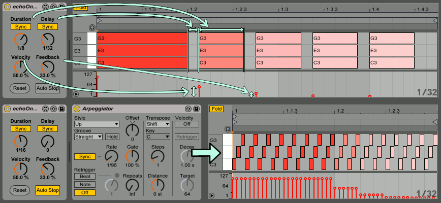

# echo on noteoff

## What is this?
An experimental Max for Live MIDI effect designed for notes in arpeggios.
Put before built-in Arpeggiator to acquire decaying effects in arpeggio notes!

## Download 
https://maxforlive.com/library/device/5563/echo-on-noteoff

## Known Issues
see [Issues](https://github.com/h1data/M4L-echo-on-noteoff/issues?q=)